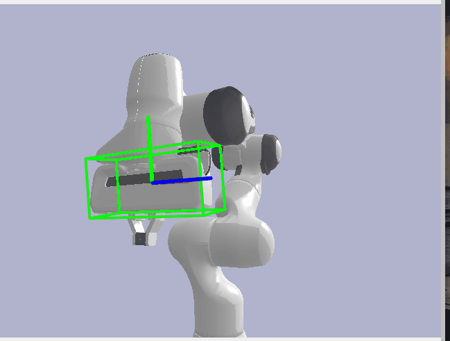
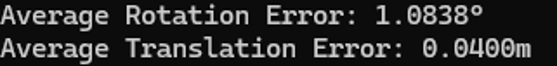

# FoundationPose Pose Estimation Evaluation on Pybullet Synthetic Robot Data


My project is built on the CVPR 2024 paper: FoundationPose by Bowen Wen, Wei Yang, Jan Kautz, Stan Birchfield
[[FoundationPosePaper]](https://arxiv.org/abs/2312.08344) [[FoundationPoseWebsite]](https://nvlabs.github.io/FoundationPose/)

I developed a synthetic data generation pipeline in Pybullet that processes the world to camera transformations, coordinate space transformations, 
and calculates the correct ground truth robot pose matrices. The pipeline uses robot (.urdf) and (.obj) files to load the robot or whichever link we want.
I then setup a virtual camera to take frames (rgb, depth, binary mask) which are all inputs the foundation model, foundationpose, needs to run successfully.
There is also code for ground truth visualizations and I also modified a script (graciously provided by Stan Birchfield of Nvidia) to 
transform a (.urdf) robot descriptor file to 1 whole (.obj) mesh file.

The ultimate goal of the project is to run multiple instances of the foundation model, one on the object to grasp and one on the robot. We then would use
the corresponding pose matrices to enable precise grasping.

Achieved following competitive errors on robot hand pose estimation
- Rotation Angle Error of 0.674 degrees
- Translation Error of 0.655 mm


FoundationPose Robot Instance



FoundationPose Object Instance using ketchup from HOPE Dataset: [[HOPE]](https://github.com/swtyree/hope-dataset)


# Data prepare
1) Download all network weights from [here](https://drive.google.com/drive/folders/1DFezOAD0oD1BblsXVxqDsl8fj0qzB82i?usp=sharing) and put them under the folder `weights/`. For the refiner, you will need `2023-10-28-18-33-37`. For scorer, you will need `2024-01-11-20-02-45`.

1) If you want to run FoundationPose on some of the original demo data from the Nvidia team: [Download demo data](https://drive.google.com/drive/folders/1pRyFmxYXmAnpku7nGRioZaKrVJtIsroP?usp=sharing) and extract them under the folder `demo_data/`. 


# Environment Setup: Docker
  ```
  cd docker/
  docker pull wenbowen123/foundationpose && docker tag wenbowen123/foundationpose foundationpose  # Or to build from scratch: docker build --network host -t foundationpose .
  bash docker/run_container.sh
  ```


If it's the first time you launch the container, you need to build extensions. Run this command *inside* the Docker container.
```
bash build_all.sh
```

Later you can execute into the container without re-build.
```
docker exec -it foundationpose bash
```

After Docker Container setup, install Pybullet via pip or another module to run my code to generate synthetic Franka Panda robot data to evaluate FoundationPose with. You can switch out the (.urdf) and (.obj) files with other robots, and this code should work with minimal tuning.


# Demo

First, try running on the given demo data from the original team (mustard bottle and driller) to learn how to run FoundationPose.

```
python run_demo.py
```

# Synthetic Data Generation

<div style="text-align: center;">
  
  
  
  
</div>


Next, go to /demo_data and run...

if you want to render a whole robot urdf inside pybullet and get images(rgb, mask, depth) and annotations for that:
```
python urdf_render.py
```

if you want to render just one link of a robot or a mesh (.obj) and get images(rgb, mask, depth)  and annotations for that:
```
python obj_render.py
```

Afterwards, you should now have a hand2cam_poses.npy inside your synth directory.
Now, run FoundationPose again, after you change the data paths to our synth directory.
```
python run_demo.py
```

# Evaluation

Finally, Take the predicted pose matrix from FoundationPose and put it into evaluation.py to get translation and rotation error for foundationpose vs ground truth!
```
python evaluation.py
```


Bonus: If you want to try different robot configurations (link0+link1 only, link0+link1+link2, etc.) use this script to generate the necessary files:
```
python urdf2obj.py
```

